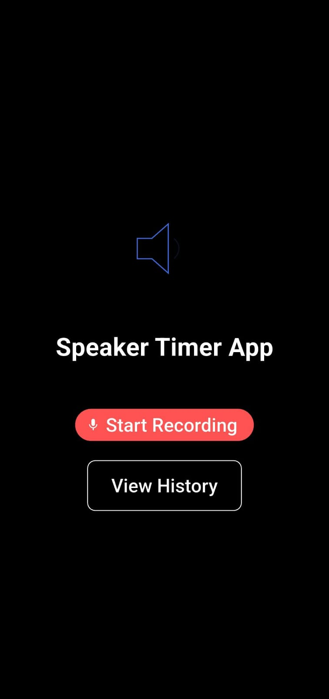
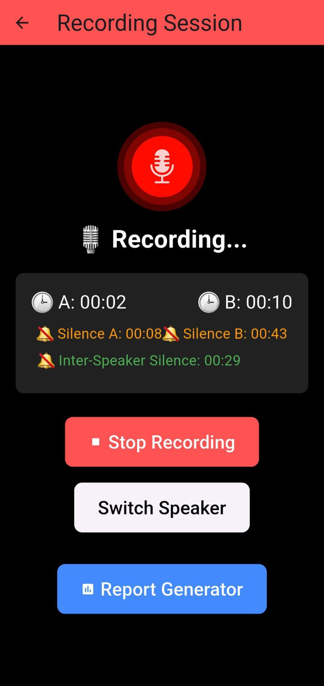
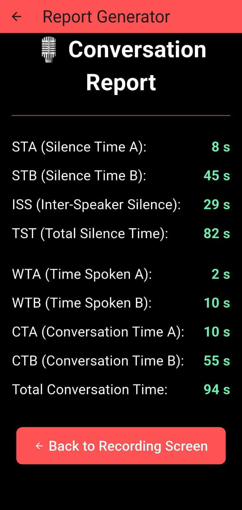

# 🎙️ Flutter Recording App  

A Flutter app for recording audio, detecting speaker activity, tracking silence time, and generating reports. 🚀  

## 📸 App Screenshots  
<p align="center">
  
  
  
</p>

<p align="center">
  <b>Home Screen</b> &nbsp;&nbsp;&nbsp;&nbsp;&nbsp;&nbsp;
  <b>Recording Screen</b> &nbsp;&nbsp;&nbsp;&nbsp;&nbsp;&nbsp;
  <b>Report Generation</b>
</p>


## ✨ Features  
✅ **Record audio** using the device microphone  
✅ **Detect speaker activity** (Speaker A & Speaker B)  
✅ **Track silence duration** for each speaker  
✅ **Monitor inter-speaker silence** when switching between speakers  
✅ **Display waveform visualization** while recording  
✅ **Generate a detailed report** of the recording session  

## 🛠️ Technologies Used  
- **Flutter** (Dart)  
- **flutter_sound** (Audio recording)  
- **audio_waveforms** (Waveform visualization)  
- **Lottie** (Animated UI components)  
- **path_provider** (File storage)  

## 🔧 Installation & Setup  

### 1️⃣ Clone the Repository  
```bash
git clone https://github.com/yourusername/flutter-recording-app.git
cd flutter-recording-app
